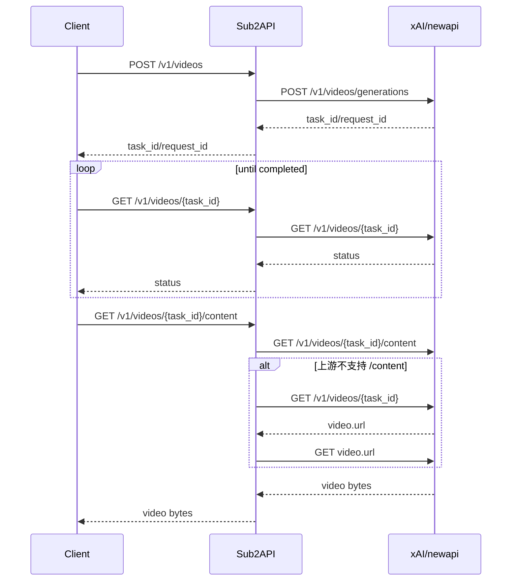

# Grok 视频接口文档

本文档描述 Sub2API 当前实现中的 Grok 视频接口。Grok 视频接口只面向平台为 `grok` 的分组开放，使用 Sub2API 用户 API Key 鉴权，并转发到 xAI/newapi 支持的视频接口：

- `POST /v1/videos`
- `GET /v1/videos/{task_id}`
- `GET /v1/videos/{task_id}/content`

兼容无 `/v1` 前缀的别名：

- `POST /videos`
- `GET /videos/{task_id}`
- `GET /videos/{task_id}/content`

注意：调用方使用 `/v1/videos`，不需要请求 `/v1/videos/generations`。网关会把对外的 `POST /v1/videos` 兼容转发到官方 xAI 上游的 `/v1/videos/generations`。

## 1. 基础信息

| 项目 | 说明 |
| --- | --- |
| 支持平台 | `grok` |
| 鉴权方式 | Sub2API 用户 API Key |
| 请求格式 | JSON；multipart form 可透传 |
| 创建接口响应 | 基本透传上游 JSON，并补充顶层 `task_id` |
| 状态接口响应 | 基本透传上游 JSON，并补充顶层 `task_id` |
| 内容接口响应 | 透传上游原始响应，通常为 `video/*` 二进制 |
| 上游 Base URL | Grok 账号配置中的 `base_url`，通常为 `https://api.x.ai/v1` 或兼容地址 |

## 2. 鉴权

推荐使用：

```http
Authorization: Bearer <sub2api_api_key>
```

兼容以下 header：

```http
x-api-key: <sub2api_api_key>
x-goog-api-key: <sub2api_api_key>
```

不要把 key 放在 query string，例如 `?api_key=...` 或 `?key=...`。项目中 query 传 key 会被拒绝。

## 3. 权限和分组要求

1. API Key 所属分组的平台必须是 `grok`。
2. 视频创建属于媒体生成请求，复用分组的图片生成权限开关；如果分组未开启图片生成权限，会返回 `403 permission_error`。
3. 查询任务状态和下载视频内容不要求图片生成权限，但仍要求有效 API Key、有效分组和可用 Grok 账号。
4. 非 Grok 分组调用视频接口会返回 `404 not_found_error`，提示当前平台不支持 Videos API。

## 4. 创建视频

### 4.1 接口

```http
POST /v1/videos
Content-Type: application/json
Authorization: Bearer <sub2api_api_key>
```

无 `/v1` 别名：

```http
POST /videos
```

### 4.2 JSON 请求字段

| 字段 | 类型 | 必填 | 说明 |
| --- | --- | --- | --- |
| `model` | string | 是 | 视频模型。常用：`grok-imagine-video`、`grok-imagine-video-1.5` |
| `prompt` | string | 建议必填 | 视频提示词。网关不强制，但上游通常需要 |
| `aspect_ratio` | string | 否 | 画幅比例，如 `16:9`、`9:16`、`1:1` 等；网关保留并转发上游 |
| `resolution` | string | 否 | 分辨率。计费归一化支持 `480p`、`720p`、`1080p`，以及 `sd`、`hd`、`fhd` 等别名 |
| `duration` | number | 否 | 视频时长秒数。计费按 1-15 秒收敛；未传按 8 秒计费 |
| `image` | string/object/array | 否 | 图生视频输入图。推荐传官方对象 `{ "url": "https://..." }`；也兼容字符串 URL/data URL、`{ "image_url": "..." }` 或数组 |
| `image_url` | string | 否 | 图生视频输入图 URL 别名。适合通过 NewAPI 等中转层调用，避免中转层拦截 `image.url` 对象 |
| `images` | array | 否 | 多图输入，元素可为 `{ "url": "..." }`、`{ "image_url": "..." }` 或字符串 URL/data URL；转发上游时会取第一张作为 `image` |

网关会解析这些字段用于权限检查、内容安全检查、账号调度、计费和日志。未识别字段会保留并透传上游。

### 4.3 文生视频示例

```bash
curl -X POST "http://localhost:8080/v1/videos" \
  -H "Authorization: Bearer sk-xxx" \
  -H "Content-Type: application/json" \
  -d '{
    "model": "grok-imagine-video",
    "prompt": "A cinematic shot of ocean waves at sunset",
    "resolution": "720p",
    "duration": 8
  }'
```

### 4.4 图生视频示例

```bash
curl -X POST "http://localhost:8080/v1/videos" \
  -H "Authorization: Bearer sk-xxx" \
  -H "Content-Type: application/json" \
  -d '{
    "model": "grok-imagine-video-1.5",
    "prompt": "Animate this image with slow camera movement",
    "aspect_ratio": "16:9",
    "resolution": "720p",
    "duration": 10,
    "image": {
      "url": "data:image/png;base64,AAAA..."
    }
  }'
```

也兼容字符串和 OpenAI 风格对象写法：

```json
{
  "image": {
    "image_url": "https://example.com/input.png"
  }
}
```

网关转发上游前会归一化为：

```json
{
  "image": {
    "url": "https://example.com/input.png"
  }
}
```

如果通过 NewAPI 调用时 `image: { "url": "..." }` 被 NewAPI 自身拦截或报鉴权错误，可改用顶层别名：

```json
{
  "image_url": "https://example.com/input.png"
}
```

Sub2API 会在转发 xAI 前把它归一化为官方 `image.url`。

### 4.5 multipart 请求

网关可以解析 multipart 中的 `model`、`prompt`、`resolution`、`duration`、`image`、`image_url` 等字段，并将原始 multipart 请求透传上游。仅当上游兼容 multipart 视频创建时使用。

```bash
curl -X POST "http://localhost:8080/v1/videos" \
  -H "Authorization: Bearer sk-xxx" \
  -F "model=grok-imagine-video-1.5" \
  -F "prompt=Animate this picture" \
  -F "resolution=720p" \
  -F "duration=8" \
  -F "image=@input.png;type=image/png"
```

### 4.6 模型转发规则

| 入参模型 | 输入图片 | 实际上游模型 | 说明 |
| --- | --- | --- | --- |
| `grok-imagine-video` | 任意 | `grok-imagine-video` | 直接透传 |
| `grok-imagine-video-1.5` | 无 | `grok-imagine-video` | 文生视频自动回退到标准视频模型 |
| `grok-imagine-video-1.5` | 有 | `grok-imagine-video-1.5` | 图生视频保留 1.5 模型 |

## 5. 创建响应

创建接口响应体基本透传上游 JSON，但网关会在顶层补充 `task_id` 和 OpenAI/Sora 风格任务状态字段。如果响应里已经带有视频地址，网关也会复用该地址补充顶层 `url` 和 `video_url`，方便 NewAPI 任务日志直接展示视频 URL。网关会从以下字段中提取任务 ID，用于补充 `task_id`、后续粘性账号绑定和计费记录：

- `task_id`
- `taskId`
- `request_id`
- `requestId`
- `id`
- `data.task_id`
- `data.taskId`
- `data.request_id`
- `data.requestId`
- `data.id`
- `video.task_id`
- `video.taskId`
- `video.request_id`
- `video.requestId`
- `video.id`
- `task.task_id`
- `task.taskId`
- `task.request_id`
- `task.requestId`
- `task.id`

推荐上游返回：

```json
{
  "task_id": "video-task-123",
  "status": "queued"
}
```

兼容旧字段：

```json
{
  "request_id": "video-request-123",
  "task_id": "video-request-123",
  "id": "video-request-123",
  "object": "video.task",
  "status": "queued",
  "progress": 0,
  "created_at": 1780000000
}
```

调用方后续应统一把拿到的 ID 当作 `{task_id}` 使用。

## 6. 查询视频状态

### 6.1 接口

```http
GET /v1/videos/{task_id}
Authorization: Bearer <sub2api_api_key>
```

无 `/v1` 别名：

```http
GET /videos/{task_id}
```

### 6.2 示例

```bash
curl "http://localhost:8080/v1/videos/video-task-123" \
  -H "Authorization: Bearer sk-xxx"
```

### 6.3 响应

响应体基本由上游透传；如果上游只返回 `id`、`request_id` 等字段，网关会补充顶层 `task_id`，并把顶层 `status` 归一化为 OpenAI/Sora 风格任务适配器可识别的值。如果上游返回 `video.url`、`url`、`video_url`、`content_url` 等视频地址字段，网关会在顶层补齐 `url` 和 `video_url`。常见形态如下：

```json
{
  "task_id": "video-task-123",
  "id": "video-task-123",
  "status": "completed",
  "url": "https://cdn.x.ai/video.mp4",
  "video_url": "https://cdn.x.ai/video.mp4"
}
```

网关输出的顶层 `status` 会归一化为以下值：

| 状态 | 建议处理 |
| --- | --- |
| `queued` / `pending` | 继续轮询 |
| `processing` / `in_progress` | 继续轮询 |
| `completed` | 调用 content 接口下载 |
| `failed` / `cancelled` | 停止轮询，展示错误 |

上游返回的 `running`、`generating`、`succeeded`、`done`、`canceled`、`error` 等别名会被映射到上表中的兼容状态；如果上游未返回状态，网关会根据 `error`、`video.url`、`progress` 等字段推断兜底状态。

## 7. 下载视频内容

### 7.1 接口

```http
GET /v1/videos/{task_id}/content
Authorization: Bearer <sub2api_api_key>
```

无 `/v1` 别名：

```http
GET /videos/{task_id}/content
```

### 7.2 示例

```bash
curl "http://localhost:8080/v1/videos/video-task-123/content" \
  -H "Authorization: Bearer sk-xxx" \
  --output output.mp4
```

### 7.3 响应

网关会透传上游响应头和响应体。常见响应：

```http
HTTP/1.1 200 OK
Content-Type: video/mp4
```

响应体为视频二进制内容。若上游未返回 `Content-Type`，网关会默认写为 `application/json`；正常视频内容应由上游返回正确的 `video/*` 类型。

注意：该接口使用非流式读取上游响应，受 `gateway.upstream_response_read_max_bytes` 限制；默认上限为 128 MiB。视频文件超过该上限时会返回上游响应过大的错误。

## 8. 推荐调用流程



## 9. 账号调度和粘性会话

创建视频成功后，如果响应中能提取到任务 ID，网关会把该任务 ID 与本次使用的 Grok 账号绑定。后续状态查询和内容下载会使用 `task_id` 派生粘性会话，尽量回到同一个账号查询。

如果上游创建响应中没有可识别的 `task_id`、`request_id` 或 `id`，网关无法绑定任务与账号，后续查询可能由调度器选择其他 Grok 账号，导致上游返回未找到任务。建议上游创建响应始终返回稳定任务 ID。

## 10. 计费说明

只有 `POST /v1/videos` 创建请求会记录视频生成用量；状态查询和内容下载不记录生成用量。

计费字段：

| 字段 | 说明 |
| --- | --- |
| `model` | 使用请求模型；若文生 `grok-imagine-video-1.5` 被转发为 `grok-imagine-video`，计费用模型也会按转发后模型记录 |
| `resolution` | 归一化为 `480p`、`720p` 或 `1080p`；无法识别时按 `480p` |
| `duration` | 小于等于 0 或未传时按 8 秒；小于 1 秒按 1 秒；大于 15 秒按 15 秒 |
| `video_count` | 当前按 1 个视频记录 |

默认视频价格为每秒单价：

| 模型 | 480p | 720p | 1080p |
| --- | ---: | ---: | ---: |
| `grok-imagine-video` | 0.05 USD/s | 0.07 USD/s | 0.07 USD/s |
| `grok-imagine-video-1.5` | 0.08 USD/s | 0.14 USD/s | 0.25 USD/s |

分组可配置独立的视频价格：

- `video_price_480p`
- `video_price_720p`
- `video_price_1080p`

分组也支持视频独立倍率：

- `video_rate_independent`
- `video_rate_multiplier`

## 11. 内容安全检查

创建视频时，网关会把 `prompt` 和输入图片提取出来送内容安全检查：

- JSON 中的 `image`、`images`
- multipart 中的 `image`、`image[]`
- `image_url`

如果内容安全检查判定阻断，请求会在转发上游前被拒绝。

## 12. 错误格式

公开接口错误采用 OpenAI-compatible 风格：

```json
{
  "error": {
    "type": "invalid_request_error",
    "message": "model is required"
  }
}
```

常见错误：

| HTTP 状态 | type | 场景 |
| --- | --- | --- |
| `400` | `invalid_request_error` | 请求体为空、缺少 `model`、缺少 `task_id`、请求体读取失败 |
| `401` | `authentication_error` | API Key 缺失或无效 |
| `403` | `permission_error` | 分组未开启媒体生成权限或内容安全阻断 |
| `404` | `not_found_error` | 非 Grok 分组调用视频接口，或上游任务不存在 |
| `429` | `rate_limit_error` | 上游限流、本地限流或账号配额不足 |
| `502` | `upstream_error` | 上游请求失败、上游响应过大或无可用账号 |

## 13. 排错

### 13.1 `404 Videos API is not supported for this platform`

API Key 所属分组不是 `grok`。请检查分组平台配置。

### 13.2 `400 model is required`

创建视频时没有传 `model`，或 multipart 中字段名不对。

### 13.3 `400 task_id is required`

调用状态或内容接口时路径里没有任务 ID。正确格式：

```http
GET /v1/videos/{task_id}
GET /v1/videos/{task_id}/content
```

### 13.4 查询任务返回不存在

常见原因：

1. 创建响应没有返回可识别任务 ID，导致粘性账号绑定失败。
2. 查询时使用的 ID 不是创建响应中的任务 ID。
3. 上游任务过期或被取消。
4. Grok 账号池中多个账号混用，任务只存在于创建账号下。

### 13.5 下载内容返回 JSON

说明上游可能还没生成完成，或者上游返回了错误 JSON。应先调用状态接口，确认任务完成后再下载 content。

## 14. 与旧路径的差异

旧实现或 OpenAI 风格可能使用：

```http
POST /v1/videos/generations
```

当前 Grok/newapi 对外视频实现改为：

```http
POST /v1/videos
```

网关转发创建请求时固定使用官方 xAI 路径 `/v1/videos/generations`。调用方不需要感知上游路径，只请求 `/v1/videos`。

查询和下载分别为：

```http
GET /v1/videos/{task_id}
GET /v1/videos/{task_id}/content
```

调用方不要再请求 `/v1/videos/generations`。
